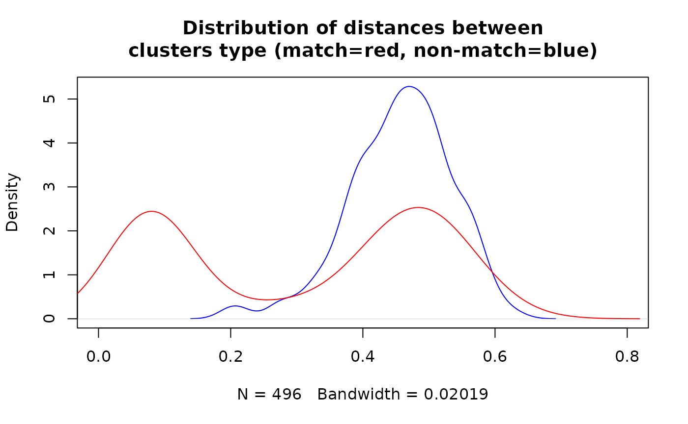

# Blocking records for deduplication

## Setup

Read required packages.

``` r
library(blocking)
library(data.table)
```

Read the `RLdata500` data (taken from the
[RecordLinkage](https://CRAN.R-project.org/package=RecordLinkage)
package).

``` r
data(RLdata500)
setDT(RLdata500)
head(RLdata500)
#>    fname_c1 fname_c2 lname_c1 lname_c2    by    bm    bd rec_id ent_id
#>      <char>   <char>   <char>   <char> <int> <int> <int>  <int>  <int>
#> 1:  CARSTEN             MEIER           1949     7    22      1     34
#> 2:     GERD             BAUER           1968     7    27      2     51
#> 3:   ROBERT          HARTMANN           1930     4    30      3    115
#> 4:   STEFAN             WOLFF           1957     9     2      4    189
#> 5:     RALF           KRUEGER           1966     1    13      5     72
#> 6:  JUERGEN            FRANKE           1929     7     4      6    142
```

This dataset contains 500 rows with 450 entities.

## Blocking for deduplication

Now we create a new column that concatenates the information in each
row.

``` r
RLdata500[, id_count :=.N, ent_id] ## how many times given unit occurs
RLdata500[, bm:=sprintf("%02d", bm)] ## add leading zeros to month
RLdata500[, bd:=sprintf("%02d", bd)] ## add leading zeros to day
RLdata500[, txt:=tolower(paste0(fname_c1,fname_c2,lname_c1,lname_c2,by,bm,bd))]
head(RLdata500)
#>    fname_c1 fname_c2 lname_c1 lname_c2    by     bm     bd rec_id ent_id
#>      <char>   <char>   <char>   <char> <int> <char> <char>  <int>  <int>
#> 1:  CARSTEN             MEIER           1949     07     22      1     34
#> 2:     GERD             BAUER           1968     07     27      2     51
#> 3:   ROBERT          HARTMANN           1930     04     30      3    115
#> 4:   STEFAN             WOLFF           1957     09     02      4    189
#> 5:     RALF           KRUEGER           1966     01     13      5     72
#> 6:  JUERGEN            FRANKE           1929     07     04      6    142
#>    id_count                    txt
#>       <int>                 <char>
#> 1:        1   carstenmeier19490722
#> 2:        2      gerdbauer19680727
#> 3:        1 roberthartmann19300430
#> 4:        1    stefanwolff19570902
#> 5:        1    ralfkrueger19660113
#> 6:        1  juergenfranke19290704
```

In the next step we use the newly created column in the `blocking`
function. If we specify verbose, we get information about the progress.

``` r
df_blocks <- blocking(x = RLdata500$txt, ann = "nnd", verbose = 1, graph = TRUE, seed = 2024)
#> ===== creating tokens =====
#> ===== starting search (nnd, x, y: 500, 500, t: 429) =====
#> ===== creating graph =====
```

Results are as follows:

- based on `rnndescent` we have created 133 blocks,
- 429 2-character shingles have been created for the blocking,
- we have 45 blocks of 2 elements, 33 blocks of 3 elements, …, 1 block
  of 17 elements.

``` r
df_blocks
#> ========================================================
#> Blocking based on the nnd method.
#> Number of blocks: 133.
#> Number of shingles created for blocking: 429.
#> Reduction ratio: 0.9919.
#> ========================================================
#> Distribution of the size of the blocks:
#>  2  3  4  5  6  7  8  9 11 17 
#> 45 33 21 14  7  4  4  3  1  1
```

Structure of the object is as follows:

- `result` – a `data.table` with identifiers and block IDs,
- `method` – the method used,
- `deduplication` – whether deduplication was applied,
- `representation` – whether shingles or vectors were used,
- `metrics` – standard metrics and based on the
  [`igraph::compare`](https://r.igraph.org/reference/compare.html)
  methods for comparing graphs (here NULL),
- `confusion` – confusion matrix (here NULL),
- `colnames` – column names used for the comparison,
- `graph` – an `igraph` object mainly for visualisation.

``` r
str(df_blocks,1)
#> List of 8
#>  $ result        :Classes 'data.table' and 'data.frame': 367 obs. of  4 variables:
#>   ..- attr(*, ".internal.selfref")=<externalptr> 
#>  $ method        : chr "nnd"
#>  $ deduplication : logi TRUE
#>  $ representation: chr "shingles"
#>  $ metrics       : NULL
#>  $ confusion     : NULL
#>  $ colnames      : chr [1:429] "86" "ap" "av" "bf" ...
#>  $ graph         :Class 'igraph'  hidden list of 10
#>  - attr(*, "class")= chr "blocking"
```

Plot connections.

``` r
plot(df_blocks$graph, vertex.size=1, vertex.label = NA)
```


The resulting `data.table` has four columns:

- `x` – reference dataset (i.e. `RLdata500`) – this may not contain all
  units of `RLdata500`,
- `y` - query (each row of `RLdata500`) – this may not contain all units
  of `RLdata500`,
- `block` – the block ID,
- `dist` – distance between objects.

``` r
head(df_blocks$result)
#>        x     y block       dist
#>    <int> <int> <num>      <num>
#> 1:     1    64    34 0.47379869
#> 2:     2    43     1 0.08074528
#> 3:     2   486     1 0.41023219
#> 4:     3   450    89 0.43263352
#> 5:     4   234    12 0.52565837
#> 6:     5   128     2 0.51333570
```

Create long `data.table` with information on blocks and units from
original dataset.

``` r
df_block_melted <- melt(df_blocks$result, id.vars = c("block", "dist"))
df_block_melted_rec_block <- unique(df_block_melted[, .(rec_id=value, block)])
head(df_block_melted_rec_block)
#>    rec_id block
#>     <int> <num>
#> 1:      1    34
#> 2:      2     1
#> 3:      3    89
#> 4:      4    12
#> 5:      5     2
#> 6:      6    34
```

We add block information to the final dataset.

``` r
RLdata500[df_block_melted_rec_block, on = "rec_id", block_id := i.block]
head(RLdata500)
#>    fname_c1 fname_c2 lname_c1 lname_c2    by     bm     bd rec_id ent_id
#>      <char>   <char>   <char>   <char> <int> <char> <char>  <int>  <int>
#> 1:  CARSTEN             MEIER           1949     07     22      1     34
#> 2:     GERD             BAUER           1968     07     27      2     51
#> 3:   ROBERT          HARTMANN           1930     04     30      3    115
#> 4:   STEFAN             WOLFF           1957     09     02      4    189
#> 5:     RALF           KRUEGER           1966     01     13      5     72
#> 6:  JUERGEN            FRANKE           1929     07     04      6    142
#>    id_count                    txt block_id
#>       <int>                 <char>    <num>
#> 1:        1   carstenmeier19490722       34
#> 2:        2      gerdbauer19680727        1
#> 3:        1 roberthartmann19300430       89
#> 4:        1    stefanwolff19570902       12
#> 5:        1    ralfkrueger19660113        2
#> 6:        1  juergenfranke19290704       34
```

We can check in how many blocks the same entities (`ent_id`) are
observed. In our example, all the same entities are in the same blocks.

``` r
RLdata500[, .(uniq_blocks = uniqueN(block_id)), .(ent_id)][, .N, uniq_blocks]
#>    uniq_blocks     N
#>          <int> <int>
#> 1:           1   450
```

We can visualise the distances between units stored in the
`df_blocks$result` data set. Clearly we have a mixture of two groups:
matches (close to 0) and non-matches (close to 1).

``` r
hist(df_blocks$result$dist, xlab = "Distances", ylab = "Frequency", breaks = "fd",
     main = "Distances calculated between units")
```



Finally, we can visualise the result based on the information whether
block contains matches or not.

``` r
df_for_density <- copy(df_block_melted[block %in% RLdata500$block_id])
df_for_density[, match:= block %in% RLdata500[id_count == 2]$block_id]

plot(density(df_for_density[match==FALSE]$dist), col = "blue", xlim = c(0, 0.8), 
     main = "Distribution of distances between\nclusters type (match=red, non-match=blue)")
lines(density(df_for_density[match==TRUE]$dist), col = "red", xlim = c(0, 0.8))
```


